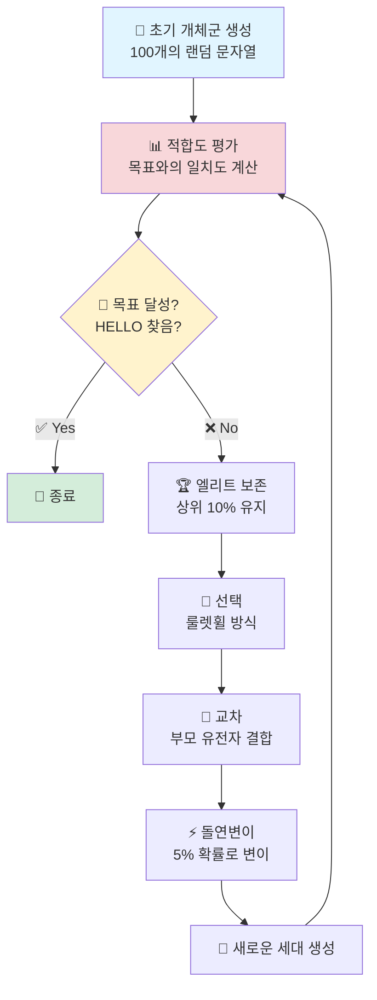

# 🧬 Genetic Algorithm - 문자열 찾기


유전 알고리즘(Genetic Algorithm)을 활용하여 목표 문자열 "HELLO"를 진화적으로 찾아내는 Python 프로젝트입니다.

## 📋 프로젝트 개요

이 프로젝트는 생물학적 진화 과정을 모방한 최적화 알고리즘인 유전 알고리즘의 기본 원리를 시연합니다. 무작위로 생성된 문자열들이 세대를 거듭하며 선택, 교차, 돌연변이 과정을 통해 목표 문자열 "HELLO"로 진화해가는 과정을 보여줍니다.

## 🔄 알고리즘 흐름도



## 🎯 주요 기능

### 1. **적합도 평가 (Fitness Function)**
- 각 개체(문자열)가 목표 문자열과 얼마나 일치하는지 점수 계산
- 일치하는 문자 개수가 많을수록 높은 점수 부여

### 2. **선택 (Selection)**
- 룰렛휠 방식의 선택 메커니즘
- 적합도가 높은 개체일수록 다음 세대에 유전자를 전달할 확률이 높음

### 3. **교차 (Crossover)**
- 두 부모 개체의 유전자를 결합하여 자식 개체 생성
- 무작위 교차점을 기준으로 유전자 교환

### 4. **돌연변이 (Mutation)**
- 5% 확률로 무작위 문자 변경
- 지역 최적해(Local Optimum) 탈출을 위한 다양성 확보

### 5. **엘리트 보존 (Elitism)**
- 상위 10% 우수 개체를 다음 세대에 자동 보존
- 진화 과정에서 최적해 손실 방지

## 🚀 실행 방법

### 필요 환경
- Python 3.x
- 외부 라이브러리 불필요 (표준 라이브러리만 사용)

### 실행 명령어
```bash
python "유전자 코드 HELLO 찾기.py"
```

## 📊 실행 결과 예시

```
--- 유전자 알고리즘 시연 시작 ---
세대:    0 | 최고 적합도: 1/5 | 최고 해: HQWRT
세대:   10 | 최고 적합도: 2/5 | 최고 해: HEXLO
세대:   25 | 최고 적합도: 3/5 | 최고 해: HELLO
세대:   42 | 최고 적합도: 4/5 | 최고 해: HELLO
세대:   58 | 최고 적합도: 5/5 | 최고 해: HELLO

!!! 목표 해답을 찾았습니다. 시연 종료. !!!
```

## ⚙️ 알고리즘 파라미터

| 파라미터 | 값 | 설명 |
|---------|-----|------|
| `TARGET` | "HELLO" | 찾아야 할 목표 문자열 |
| `POPULATION_SIZE` | 100 | 한 세대당 개체 수 |
| `MUTATION_RATE` | 0.05 | 돌연변이 발생 확률 (5%) |
| `GENES` | A-Z + 공백 | 사용 가능한 문자 집합 |
| 엘리트 비율 | 10% | 다음 세대로 보존되는 우수 개체 비율 |

## 🔧 코드 구조

```
유전자 코드 HELLO 찾기.py
├── calculate_fitness()           # 적합도 계산
├── create_individual()            # 개체 생성
├── create_initial_population()    # 초기 개체군 생성
├── selection_and_crossover()      # 선택 및 교차
├── mutate()                       # 돌연변이
└── run_ga()                       # 메인 GA 루프
```

## 💡 학습 포인트

1. **진화 알고리즘의 기본 원리** - 자연선택과 유전의 개념을 계산에 적용
2. **최적화 문제 해결** - 무작위 탐색보다 효율적인 해 탐색
3. **탐색과 활용의 균형** - 돌연변이(탐색)와 교차(활용)의 조화
4. **엘리트 전략** - 좋은 해를 보존하며 진화

## 📝 커스터마이징 방법

### 목표 문자열 변경
```python
TARGET = "YOUR TEXT"  # 원하는 문자열로 변경
```

### 개체군 크기 조정
```python
POPULATION_SIZE = 200  # 더 큰 개체군은 다양성↑, 계산시간↑
```

### 돌연변이 확률 조정
```python
MUTATION_RATE = 0.1  # 높을수록 탐색력↑, 수렴속도↓
```

## 📚 참고 자료

- **유전 알고리즘 (Genetic Algorithm)**: 자연선택과 유전학에 기반한 최적화 알고리즘
- **응용 분야**: 일정 최적화, 경로 탐색, 신경망 학습, 게임 AI 등

## 📄 라이선스

이 프로젝트는 교육 목적으로 제작되었습니다.

---

**Made with 🧬 Genetic Algorithm**
